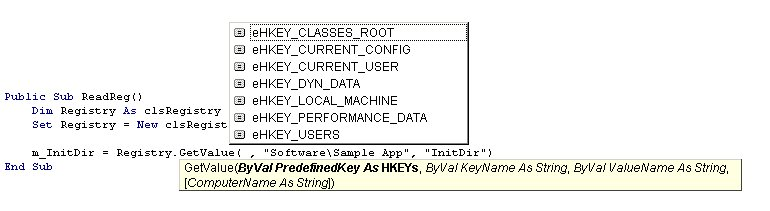



## clsRegistry

### Description

Read, Write, Create, Delete, and Enum registry keys and values on local and remote computers.
 
### More Info
 
See examples in source.

             |
---                |---
**Submitted On**   |2002-12-30 20:03:52
**By**             |[Zakk Hoyt](https://github.com/Planet-Source-Code/PSCIndex/blob/master/ByAuthor/zakk-hoyt.md)
**Level**          |Intermediate
**User Rating**    |5.0 (30 globes from 6 users)
**Compatibility**  |VB 6\.0
**Category**       |[Registry](https://github.com/Planet-Source-Code/PSCIndex/blob/master/ByCategory/registry__1-36.md)
**World**          |[Visual Basic](https://github.com/Planet-Source-Code/PSCIndex/blob/master/ByWorld/visual-basic.md)
**Archive File**   |[clsRegistr15208912302002\.zip](https://github.com/Planet-Source-Code/zakk-hoyt-clsregistry__1-42021/archive/master.zip)

### API Declarations

All included already.

